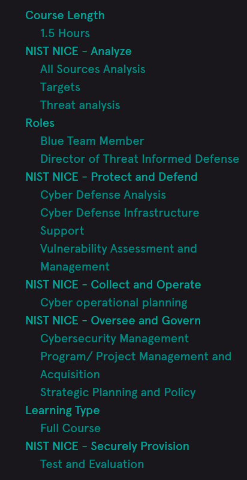

# 🛡️ Foundations of Purple Teaming – AttackIQ Academy  

This repository contains **notes, labs, playbooks, resources, and certificate of completion** for the *Foundations of Purple Teaming* course by **AttackIQ Academy**.  
The course provides a structured foundation in **red and blue team collaboration, adversary emulation, detection engineering, incident response, and purple team methodology**.  

---

## 📚 Notes  

- 📄 [`01-introduction-to-purple-teaming.md`](./notes/01-introduction-to-purple-teaming.md) – Introduction to Purple Teaming  
- 📄 [`02-threat-modeling-and-adversary-emulation.md`](./notes/02-threat-modeling-and-adversary-emulation.md) – Threat modeling & adversary emulation  
- 📄 [`03-attack-surface-and-reconnaissance.md`](./notes/03-attack-surface-and-reconnaissance.md) – Attack surface & reconnaissance  
- 📄 [`04-adversary-techniques-overview.md`](./notes/04-adversary-techniques-overview.md) – Adversary techniques overview  
- 📄 [`05-detection-engineering-principles.md`](./notes/05-detection-engineering-principles.md) – Detection engineering principles  
- 📄 [`06-telemetry-and-logging.md`](./notes/06-telemetry-and-logging.md) – Telemetry & logging  
- 📄 [`07-detection-rules-and-signatures.md`](./notes/07-detection-rules-and-signatures.md) – Detection rules & signatures  
- 📄 [`08-threat-hunting-methodologies.md`](./notes/08-threat-hunting-methodologies.md) – Threat hunting methodologies  
- 📄 [`09-incident-response-collaboration.md`](./notes/09-incident-response-collaboration.md) – Incident response collaboration  
- 📄 [`10-red-team-exercises-for-purple.md`](./notes/10-red-team-exercises-for-purple.md) – Red team exercises for purple teaming  
- 📄 [`11-blue-team-defensive-controls.md`](./notes/11-blue-team-defensive-controls.md) – Blue team defensive controls  
- 📄 [`12-attack-simulation-with-attackiq-platform.md`](./notes/12-attack-simulation-with-attackiq-platform.md) – Attack simulation with AttackIQ platform  
- 📄 [`13-measurement-and-metrics.md`](./notes/13-measurement-and-metrics.md) – Measurement & metrics  
- 📄 [`14-automation-and-playbooks.md`](./notes/14-automation-and-playbooks.md) – Automation & playbooks  
- 📄 [`15-reporting-and-mitigation.md`](./notes/15-reporting-and-mitigation.md) – Reporting & mitigation  

---

## 🧪 Labs  

- 🟣 [`purple-team-labs.md`](./labs/purple-team-labs.md) – Purple team collaboration labs  
- 📡 [`telemetry-labs.md`](./labs/telemetry-labs.md) – Telemetry collection & analysis labs  
- 🔴 [`red-team-simulations.md`](./labs/red-team-simulations.md) – Red team simulation labs  
- 🔵 [`blue-team-detection-workshops.md`](./labs/blue-team-detection-workshops.md) – Blue team detection workshops  
- 🛠️ [`hands-on-exercises.md`](./labs/hands-on-exercises.md) – Hands-on exercises  

---

## 📓 Playbooks  

- 📘 [`00-index.md`](./playbooks/00-index.md) – Playbooks index  
- 📧 [`01-phishing-response.md`](./playbooks/01-phishing-response.md) – Phishing response  
- ☣️ [`02-ransomware-containment.md`](./playbooks/02-ransomware-containment.md) – Ransomware containment  
- 🔑 [`03-credential-theft.md`](./playbooks/03-credential-theft.md) – Credential theft handling  
- ↔️ [`04-lateral-movement-detection.md`](./playbooks/04-lateral-movement-detection.md) – Lateral movement detection  
- 📤 [`05-data-exfiltration.md`](./playbooks/05-data-exfiltration.md) – Data exfiltration response  

---

## 📂 Extras  

- 📑 [`case-studies.md`](./extras/case-studies.md) – Case studies on purple teaming  
- 📚 [`resources.md`](./extras/resources.md) – References & resources  
- ⏳ [`timeline.md`](./extras/timeline.md) – Timeline & learning schedule  

---

## 📖 Docs  

- 📘 [`01-index.md`](./docs/01-index.md) – Course index  
- 📘 [`02-syllabus.md`](./docs/02-syllabus.md) – Syllabus  
- 📘 [`03-roadmap.md`](./docs/03-roadmap.md) – Learning roadmap  
- 📘 [`04-prerequisites.md`](./docs/04-prerequisites.md) – Prerequisites  
- 📘 [`05-learning-path.md`](./docs/05-learning-path.md) – Learning path  
- 📘 [`06-assessment.md`](./docs/06-assessment.md) – Assessments  
- 📘 [`07-references.md`](./docs/07-references.md) – References  
- 📘 [`08-glossary.md`](./docs/08-glossary.md) – Glossary  
- 📘 [`09-contributors.md`](./docs/09-contributors.md) – Contributors  
- 📘 [`10-changelog.md`](./docs/10-changelog.md) – Changelog  

---

## 📸 Screenshots  

| Step                  | Screenshot |
|-----------------------|------------|
| 🏫 Course Details     |  |
| 📋 Course Information |  |

---

## 📜 Certificate  

🎓 [`Foundations of Purple Teaming`](./cert/Foundations%20of%20Purple%20Teaming.png)  

---

## 📝 Personal Review  

This course significantly strengthened my understanding of **how red and blue teams can collaborate** effectively through **purple team methodology**.  
I practiced adversary emulation, detection engineering, and joint incident response through structured labs and playbooks.  

The most valuable takeaway was the **hands-on integration of red and blue team exercises** using the **AttackIQ platform**, which helped me understand how to align detection rules, improve telemetry, and measure security effectiveness.  

By combining **adversary techniques** with **defensive controls**, I learned how to build **continuous feedback loops** that improve both offensive and defensive capabilities in real-world environments.  

Overall, this course is highly recommended for anyone seeking to bridge the gap between **offensive and defensive security operations**.  

---

## ✍️ Author  

**Thành Danh** – Red Team Learner & Security Researcher  

- GitHub: [@ngvuthdanhh](https://github.com/ngvuthdanhh)  
- Email: ngvu.thdanh@gmail.com  

---

## 📄 License  

This project is licensed under the terms of the **MIT License**.  
See [`LICENSE`](./LICENSE) for full details.  

© 2025 ngvuthdanhh. All rights reserved.  
